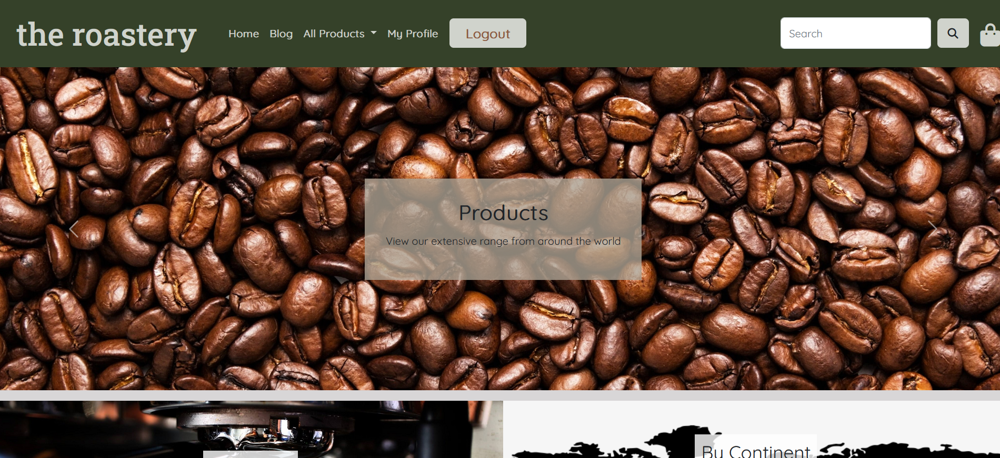
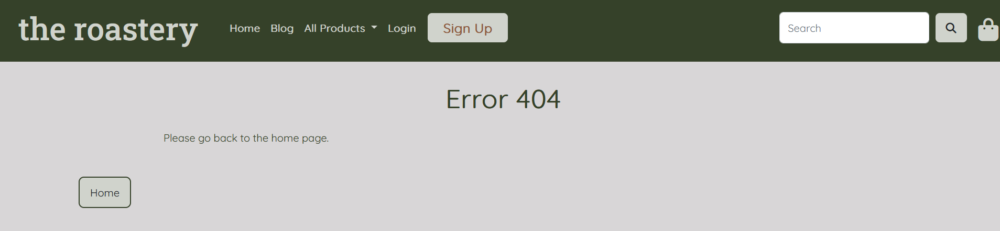
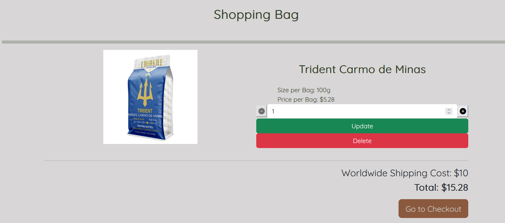
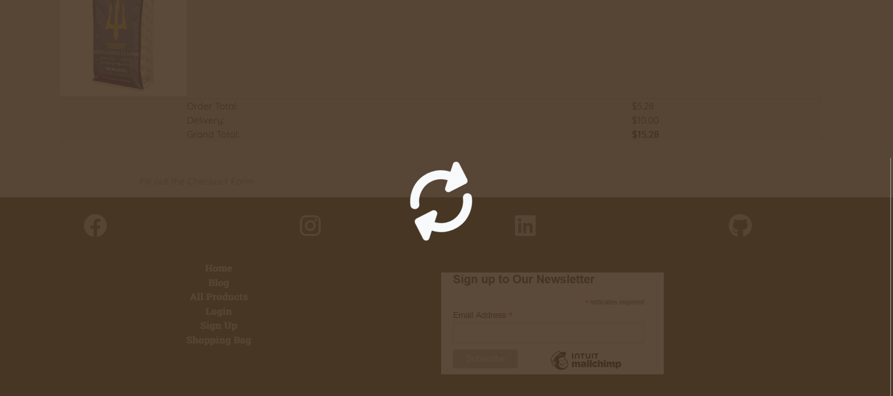

# Manual Tests

[Go Back to README.md](https://github.com/Grawnya/the-roastery-ecommerce-store)

The manual testing aligns with the user stories created to ensure all the functionality to meet their criteria works. The manual testing was broken down into the followign epics

> 

## Epic 1: Core Website Functionality
### Related User Stories
[1](https://github.com/Grawnya/the-roastery-ecommerce-store/issues/1) - As a user I can navigate through the website easily so that I can get more information about the coffees available to buy.
\
&nbsp;
[3](https://github.com/Grawnya/the-roastery-ecommerce-store/issues/3) - As a user I can find the coffee company's social media accounts so that I can keep up-to-date with any news.
\
&nbsp;

These 2 User Stories’ criteria are met on the [Home Page](#landing-page "Home Page") and the [Products Page](#products-page "Products Page"). The home page consists of various sections to ensure that the user is informed at all times:

* The criteria of [1](https://github.com/Grawnya/the-roastery-ecommerce-store/issues/1) is met on the home page directly by scrolling down or by clicking on the link on the information carousel, which redirects the user to the [Products Page](#products-page "Products Page"). The [Products Page](#products-page "Products Page") enables the user to scroll through the available coffees. If the user clicks on a specific coffee, they can view more details, including a detailed review/description.
* The [footer](#footer "Footer"), which meets the criteria of [3]( https://github.com/Grawnya/the-roastery-ecommerce-store/issues/3), as it can be easily reached on the home page directly by scrolling down the page.

The website is generally well laid out and uses a suitable colour scheme to easily read all its content. It also utilises links to the various pages on the site via a navbar, footer and buttons to provide a logical flow that is easy to understand, meeting the criteria of [1](https://github.com/Grawnya/the-roastery-ecommerce-store/issues/1).

> 
\
&nbsp;

The criteria for [3](https://github.com/Grawnya/the-roastery-ecommerce-store/issues/3) was met by placing social media links in the footer, where the user can select the icons for the various social media sites to connect with “The Roastery”. These symbols are the universal method to reach the coffee shop’s accounts from their own website. 

> 
\
&nbsp;

[6](https://github.com/Grawnya/the-roastery-ecommerce-store/issues/6) - As a user I can access the website on mobile, tablet or larger screens so that I can view the information regardless of the device.

The criteria of [6](https://github.com/Grawnya/the-roastery-ecommerce-store/issues/6) was tested by using a mobile first design approach and constantly testing the responsiveness of the website. Checks on various devices and browsers ensures that the criteria was met.
\
&nbsp;

[2](https://github.com/Grawnya/the-roastery-ecommerce-store/issues/2) - As a user I can get information regarding the coffee company's story and the coffee they sell so that I can decide whether I want to purchase from them or not.

The criteria of [2](https://github.com/Grawnya/the-roastery-ecommerce-store/issues/2) is met on the home page directly by scrolling down or by clicking on the link on the information carousel, which redirects the user to the [Blog Page](#blog-page "Blog Page"). The [Blog Page](#blog-page "Blog Page") enables the user to go to the “Our Story” section and view the story of the ecommerce store.

> 
\
&nbsp;

[4](https://github.com/Grawnya/the-roastery-ecommerce-store/issues/4) - As a user I can easily use the navbar to navigate the website so that I can find all relevant content.

The criteria for [4](https://github.com/Grawnya/the-roastery-ecommerce-store/issues/4) was met by placing a navbar at the top of the website. It contains all important links and ensures navigation is easy. This was manually tested by going through each link. On smaller screens, the navbar collapses into a hamburger button.

> 
\
&nbsp;

[5](https://github.com/Grawnya/the-roastery-ecommerce-store/issues/5) - As a user I can easily reach the home page in case I get an error so that I am not stuck on an error page and have to select the back button.

The criteria for [5](https://github.com/Grawnya/the-roastery-ecommerce-store/issues/5) was met by creating 404 and 500 error pages that would provide the user with some information as to what went wrong. These were manually tested by checking all the button links were successful when causing the errors to occur. The navbar located at the top of the error pages also allows for easy navigation back to the homepage.

> 
\
&nbsp;

Manual testing here also included: 
* Verifying that the items in this section stacked on top of each other for smaller screens so the information was still easy to obtain. 
* Ensuring that all links worked and redirected the user to the suitable page.
* Making sure that the Mailchimp newsletter section worked.
\
&nbsp;

## Epic 2: Product Functionality
### Related User Stories
[7](https://github.com/Grawnya/the-roastery-ecommerce-store/issues/7) - As a user I can view all coffee products that are available to purchase.

This user story links in quite strongly with [1](https://github.com/Grawnya/the-roastery-ecommerce-store/issues/1) where the user wants to discover a [Products Page](#products-page "Products Page") to discover all the available coffees. All the different methods to reach this page are manually tested that they do not create an error.
\
&nbsp;

[8](https://github.com/Grawnya/the-roastery-ecommerce-store/issues/8) - As a user I can filter all the coffees by the different categories so that I can view what I prefer.

The criteria was met for [8](https://github.com/Grawnya/the-roastery-ecommerce-store/issues/8) by including a filtering option on the [Products Page](#products-page "Products Page"). Originally it was a drop down option, but a bug in the associated jQuery was not resolved and therefore, it was deemed more feasible to create buttons. These buttons group the coffee by continent location and roast, as well as ordering the whole list by price (cheapest to most expensive). The manual tests ensured that the filtering functionality worked successfully.
\
&nbsp;

[9](https://github.com/Grawnya/the-roastery-ecommerce-store/issues/9) - As a user I can find all the product details so that I can decide whether I want to add it to my shopping bag.

If a user click on the specific product on the products page, they are redirected to a detailed page for that specific product, Characteristics such as roast type, review and rating can all be found on the page. These were read from a table and cannot be edited unless a super user or administrator edits the values. The image is also enlarged to make it easier to look at the details within the image.

> 

\
&nbsp;

Manual testing here also included: 
* Verifying that the items in the products all maintained their detail for various screen sizes. 
* If a user puts in a url for a unique product, but it doesn’t exist, they are redirected to an error page.
* If no image is included in a specific product, a sample base image is used.
* If a user searches for a specific product, it appears and the user can also search for a specific roast type.
\
&nbsp;

## Epic 3: Ordering Functionality
### Related User Stories
[10](https://github.com/Grawnya/the-roastery-ecommerce-store/issues/10) - As a user I want to preview my order so that I can make a final selection before I purchase it.

The criteria for [10](https://github.com/Grawnya/the-roastery-ecommerce-store/issues/10) is achieved by creating an ordering “waiting room”. Essentially the Shopping Bag app acts as a place where the user can consider their order and when they are ready to commit to it, they can progress onto the Checkout app.

Extensive manual testing occurred here:
* All buttons were verified on the page ensuring that they work.
* The logic for the increasing and decreasing the item amount was extensively checked to ensure there was a min and max order limit for that part and that would activate an error if too many of a part were ordered. The “-“ and “+” buttons were checked to ensure that they increment the order and that it is successfully added to the context processor shopping bag.
* The update and delete buttons were checked to ensure that they either deleted the item from the shopping bag or updated the desired amount.
* Checking if the accurate items were conducted from the shopping to the checkout app, was thoroughly investigated.

> 
\
&nbsp;

[12](https://github.com/Grawnya/the-roastery-ecommerce-store/issues/12) - As a user I can purchase the items in my shopping bag by card so that I can successfully buy them.

[12](https://github.com/Grawnya/the-roastery-ecommerce-store/issues/12) was the most thoroughly tested user case in the whole project. The criteria is successfully met as there was a card section at the bottom of the checkout page that successfully creates an order if all order and card details are correct. The stripe API was used to ensure that this happened.

Manual testing associated to this ticket and the checkout page included:
* Making sure that the order was accurate by reading the values from the closed down extendable section at the top of the page.
* Different scenarios for logged in and non-logged-in users were looked at with regards to filling in the checkout form. If a user had filled in a profile, it was vital that it automatically would read into the shipping details section.
* If the user put in an acceptable card, it was teste that they should be redirected to the checkout success page.
* The logic was written and extensively tested that if the purchase was successful, that an order was created and if the order could not be created by the script’s logic, that the successful payment intent function could create the order.
* In order to prevent the user from editing their order once a card payment was made, an overlay was generated to prevent the suer from clicking or disturbing anything on the website.
* If the purchase was successful, it was shown that a success message was generated with the order and that the user also can view their order in their profile.

> 
\
&nbsp;

## Epic 4: Profile Functionality
### Related User Stories

## Epic 5: Admin Functionality
### Related User Stories