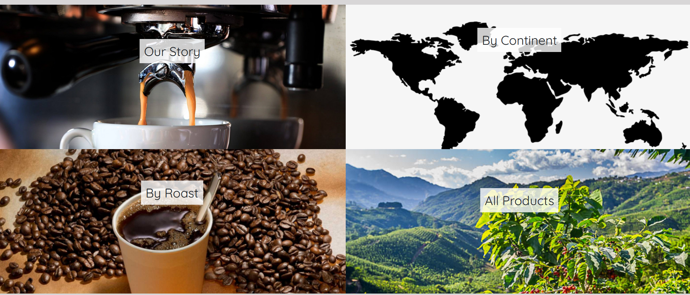
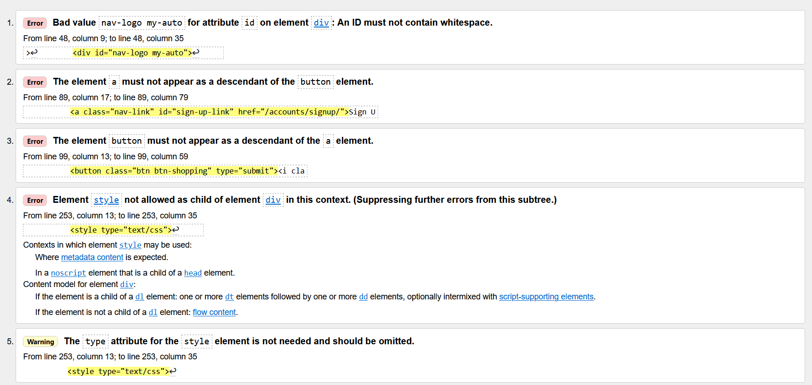
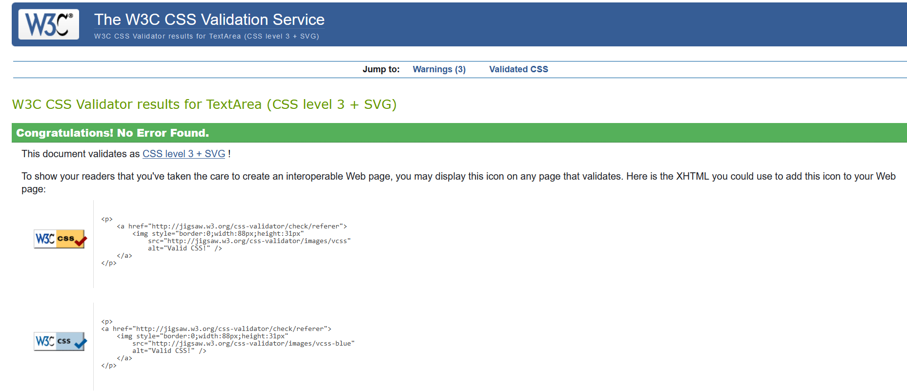
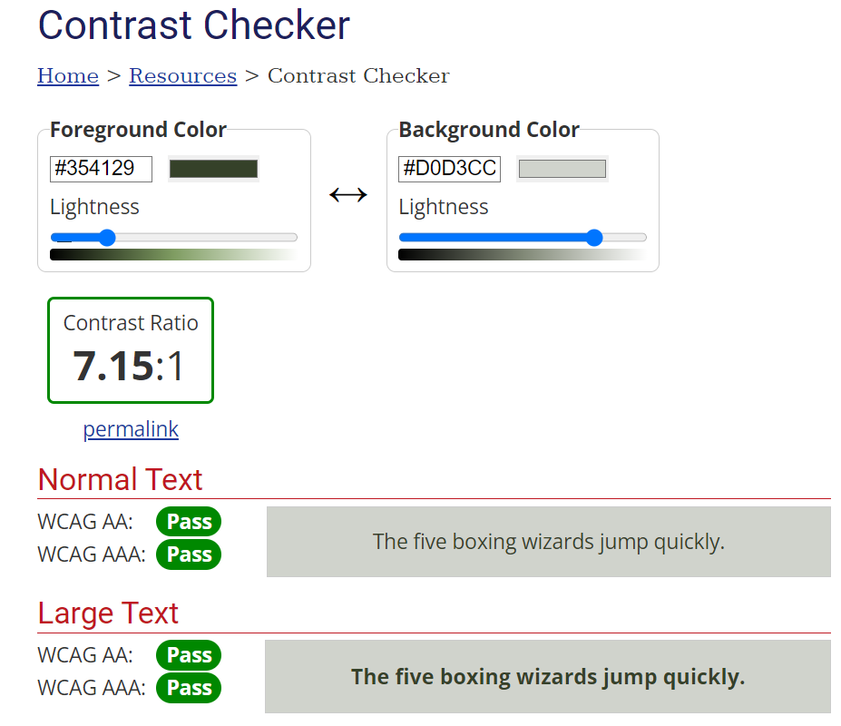

# The Roastery E-Commerce Store

## Introduction

Welcome to the coding repository dedicated to the "The Roastery"'s Ecommerce Store; A website which not only provides details about a made up coffee ecommerce website, but also allows users to buy coffee from the website.

The project is very relevant as online shopping is becoming increasingly popular, therefore, people are keen to buy everything they used daily including the coffee for their coffee machines or french presses. The flexibility of the website ensures that its design can be utilised for any ecommerce store that requires the user to purchase the products with a card in advance of receiving them.

[Visit the Website Here](https://the-roastery-1abb0b0a677e.herokuapp.com/)

[Visit the Project's GitHub Repository Here]( https://github.com/Grawnya/the-roastery-ecommerce-store)

# Table of Contents

* [UX](#ux "UX")
	* [Strategy](#strategy "Strategy")
    	* [Purpose](#purpose "purpose")
   		* [User Stories](#user-stories "User Stories")
   	        * [For This Sprint](#for-this-sprint "For This Sprint")
   	        * [For Future Sprints](#for-future-sprints "For Future Sprints")    
	* [Scope](#scope "Scope")
		* [Sprint 1](#sprint-1 "Sprint 1")
		* [Sprint 2](#sprint-2 "Sprint 2")
    	* [Future Sprints](#future-sprints "Future Sprints")
	* [Structure](#structure "Structure")
    	* [Project Applications](#project-applications "Project Applications")
    	* [Project Database](#project-database "Project Database")
		    * [Blog Model](#blog-model "Blog Model")
		    * [Order Model](#order-model "Order Model")
		    * [OrderItem Model](#orderitem-model "OrderItem Model")
		    * [Product Model](#product-model "Product Model")
		    * [Favourites Model](#favourites-model "Favourites Model")
		    * [WebsiteUser Model](#websiteuser-model "WebsiteUser Model")
		    * [OurStory Model](#ourstory-model "OurStory Model")
	* [Skeleton](#skeleton "Skeleton")
		* [Wireframes](#wireframes "Wireframes")
	* [Surface](#surface "Surface")
        * [Font](#font "Font")
	    * [Icons](#icons "Icons")
        * [Colours](#colours "Colours")
	    * [Responsive Screens](#responsive-screens "Responsive Screens")
* [Marketing](#marketing "Marketing")
	* [Marketing Plan](#marketing-plan "Marketing Plan")
	* [Facebook](#facebook "Facebook")
	* [Search Engine Optimisation](#search-engine-optimisation "Search Engine Optimisation")
* [Features](#features "Features")
	* [Existing Features](#existing-features "Existing Features")
		* [Landing Page](#landing-page "Landing Page")       
        * [Navigation Bar](#navigation-bar "Navigation Bar")       
    	* [Information Carousel](#information-carousel "Information Carousel")       
        * [Menu Sections](#menu-sections "Menu Sections")       
    	* [Footer](#footer "Footer")       
    	* [Blog Page](#blog-page "Blog Page")       
    	* [Products Page](#products-page "Products Page")       
    	* [Create and Edit Product Page](#create-and-edit-product-page "Create and Edit Product Page")       
    	* [Shopping Bag Page](#shopping-bag-page "Shopping Bag Page")       
    	* [Checkout Page](#checkout-page "Checkout Page")       
    	* [Profile](#profile "Profile")        
    	* [Django Template Pages](#django-template-pages "Django Template Pages")       
    	* [Messages](#messages "Messages")       
    	* [Error Pages](#error-pages "Error Pages")       
* [Technologies Used](#technologies-used "Technologies Used")       
	* [Languages](#languages "Languages")       
	* [Tools](#tools "Tools")       
	* [Styling](#styling "Styling")       
	* [Validation](#validation "Validation")       
	* [Databases](#databases "Databases")
* [Testing](#testing "Testing")
	* [Code Validation](#code-validation "Code Validation")
		* [W3C HTML Validator](#w3c-html-validator "W3C HTML Validator")
			* [First Attempt of Home Page](#first-attempt-of-home-page "First Attempt of Home Page")
			* [Final Attempt of Home Page](#final-attempt-of-home-page "Final Attempt of Home Page")
		* [W3C CSS Validator](#w3c-css-validator "W3C CSS Validator")
			* [First Attempt of CSS Files](#first-attempt-of-css-files "First Attempt of CSS Files")
		* [Python Syntax Checker PEP8 Validation](#python-syntax-checker-pep8-validation "Python Syntax Checker PEP8 Validation")
			* [First Attempt of Python Files](#first-attempt-of-python-files "First Attempt of Python Files")
			* [Final Attempt of Python Files](#final-attempt-of-python-files "Final Attempt of Python Files")
		* [Lighthouse](#lighthouse "Lighthouse")
		* [Responsiveness](#responsiveness "Responsiveness")
		* [Web Aim Contrast Checker](#web-aim-contrast-checker "Web Aim Contrast Checker")
		* [Browser Compatibility](#browser-compatibility "Browser Compatibility")

\
&nbsp;

# UX
User Experience of UX focuses on how accessible the website is to the user and it’s ease of use, which is pivotal the website’s success.

Therefore, the UX aspect of the project can be broken down into 5 Planes:
* The Strategy Plane
* The Scope Plane
* The Structure Plane
* The Skeleton Plane
* The Surface Plane
\
&nbsp;

## Strategy
In order to ensure the project aligns with these planes, it is vital to keep the target audience at the forefront at all times.

The target audience consists of:
* Age: 25-45 years old
* Location: Built up cities
* Income Level: Middle - high income i.e. have extra monthly disposable income.
* Occupation: Working professionals, students, and coffee industry workers
* Lifestyle: Coffee fanatics who value good quality coffee and actively seek out different coffee roasts, blends, and flavours.
* Interests: They would be more interest in high quality coffee than the average person on the street. The savour coffee rather than drink it quickly on the go as a form of energy, therefore, appreciating coffee culture, fair trade practices and sustainable practices. They are therefore willing to pay a bit more for a cup of coffee. They follow coffee blogs and social media accounts – particularly Instagram.

As a result, users will expect:
* A website with easy navigation and a logical progression to its flow.
* Plenty of information with regards to various coffees from around the world.
* The ability to order the coffee via an easy checkout process.

\
&nbsp;

### Purpose
The purpose of this website is to promote a coffee ecommerce store with the help of a fun blog and allow users to buy coffee from around the world.
\
&nbsp;

### User Stories
#### For This Sprint
| id  |  Content | Label |
| ------ | ------ | ------ |
| [1](https://github.com/Grawnya/the-roastery-ecommerce-store/issues/1) | As a user, I can navigate through the website easily so that I can get more information about the coffees available to buy. | Must Have |
| [2](https://github.com/Grawnya/the-roastery-ecommerce-store/issues/2) | As a user I can get information regarding the coffee company's story and the coffee they sell so that I can decide whether I want to purchase from them or not. | Could Have |
| [3](https://github.com/Grawnya/the-roastery-ecommerce-store/issues/3) | As a user, I can find the coffee company's social media accounts so that I can keep up-to-date with any news. | Must Have |
| [4](https://github.com/Grawnya/the-roastery-ecommerce-store/issues/4) | As a user, I can easily use the navbar to navigate the website so that I can find all relevant content. | Must Have |
| [5](https://github.com/Grawnya/the-roastery-ecommerce-store/issues/5) | As a user, I can easily reach the home page in case I get an error so that I am not stuck on an error page and have to select the back button. | Must Have |
| [6](https://github.com/Grawnya/the-roastery-ecommerce-store/issues/6) | As a user, I can access the website on mobile, tablet or larger screens so that I can view the information regardless of the device. | Must Have |
| [7](https://github.com/Grawnya/the-roastery-ecommerce-store/issues/7) | As a user, I can view all coffee products that are available to purchase. | Must Have |
| [8](https://github.com/Grawnya/the-roastery-ecommerce-store/issues/8) | As a user, I can filter all the coffees by the different categories so that I can view what I prefer. | Should Have |
| [9](https://github.com/Grawnya/the-roastery-ecommerce-store/issues/9) | As a user, I can find all the product details so that I can decide whether I want to add it to my shopping bag. | Must Have |
| [10](https://github.com/Grawnya/the-roastery-ecommerce-store/issues/10) | As a user, I want to preview my order so that I can make a final selection before I purchase it. | Must Have |
| [12](https://github.com/Grawnya/the-roastery-ecommerce-store/issues/12) | As a user, I can purchase the items in my shopping bag by card so that I can successfully buy them. | Must Have |
| [13](https://github.com/Grawnya/the-roastery-ecommerce-store/issues/13) |As a user, I can register or log in so that I can manage my orders. | Must Have |
| [14](https://github.com/Grawnya/the-roastery-ecommerce-store/issues/14) | As a user, I can see if I am logged in so that I can easily log out or log in. | Must Have |
| [15](https://github.com/Grawnya/the-roastery-ecommerce-store/issues/15) | As a user, I can edit my user details when logged in so that I can ensure that my details are up-to-date and can be used for shipping and billing. | Should Have |
| [16](https://github.com/Grawnya/the-roastery-ecommerce-store/issues/16) | As a user, I can enter my email to sign up the coffee company's newsletter to keep up-to-date with any news. | Could Have |
| [17](https://github.com/Grawnya/the-roastery-ecommerce-store/issues/17) | As a site owner/admin, I can log in so that I can access the website's backend. | Must Have |
| [18](https://github.com/Grawnya/the-roastery-ecommerce-store/issues/18) | As a site owner/admin, I can add, edit and delete items from the store so that I can ensure that the website is up-to-date. | Must Have |
| [19](https://github.com/Grawnya/the-roastery-ecommerce-store/issues/19) | As a site owner/admin, I can promote my facebook page so that I can try to increase traffic to my store. | Should Have |
| [20](https://github.com/Grawnya/the-roastery-ecommerce-store/issues/20) | As a site owner/admin, I can implement Search Engine Optimisation tactics so that I can try to increase traffic to my store. | Should Have |

\
&nbsp;

#### For Future Sprints
| id  |  Content | Label |
| ------ | ------ | ------ |
| [11](https://github.com/Grawnya/the-roastery-ecommerce-store/issues/11) | As a user, I want to receive an order confirmation via email so that I know that my order went through. | Should Have |

\
&nbsp;

## Scope
In order to ensure that the current sprint (i.e. the elements required for the current project submission) are completed, the focus was as follows:
\
&nbsp;

### Sprint 1
This sprint focuses on the “Must Haves” and the marking criteria:
* A homepage with basic details on the ecommerce website and the coffee available to buy.
* Navbar enabling the user to easily navigate through the website.
* The ability of the user to login and create a profile.
* Applications that allow the user to put coffee into their shopping basket and place that order.
\
&nbsp;

### Sprint 2
This sprint builds on Sprint 1:
* Integrate the Stripe API with the website to successfully make the order.
* Allow the user to get confirmation of order in the profile page and via a notification.
* Creating a blog page to allow the user to view relevant and engaging content.
* Adding extra details to the blog page such as allowing the user to select their favourite roast.
\
&nbsp;

### Future Sprints
Elements to add to the site in the future:
* Incorporate additional email confirmation.
* Use profile data to create a data model which can influence the best types of coffee to advertise, promote and sell.
\
&nbsp;

## Structure
Having a well-worked out project structure ensures that creating the project would occur in a more logical manner and the sprint steps can be closely followed. Therefore, the content was broken into applications to account for the various tasks and into database tables to organise how the data obtained from the user will be stored.
\
&nbsp;

### Project Applications
For this project, 6 applications were created:
* blog – To provide the user with interesting coffee centric content and allows the website owner to share interesting information and offers with the user.
* checkout – To purchase the items in the shopping bag and place an order successfully.
* home – To provide details regarding the coffee ecommerce store and encourages users to go to other parts of the website. A solely static app with no models.
* products – To view the available products on the ecommerce store and to allow the website owner to add, edit or delete existing products. 
* profile_app – To let the user put in personal details for a faster checkout if the checkout form is prepopulated and to provide useful information for the website user re demographic, favourite coffee etc.
* shopping_bag – To place products inside and therefore can ready a user’s final order.

\
&nbsp;

### Project Database
7 tables/models can be found in total throughout the project, which enable the user to create the profile required, successfully order coffee and read coffee based content. The website owner can also readily add, edit and delete content within the website. The schematic below provides the relationship between all of the tables within the project.

\
&nbsp;

#### Blog Model
The Blog model is used by the website owner to create, edit and delete relevant blog content for the website. These blogs provide either relevant information regarding “The Roastery” ecommerce store or fun and interesting coffee centric posts, which encourage the user to buy coffee.

It can be broken down as follows:
* `heading` - Heading of the blog post.
* `blog_body` - Body of the blog post.
* `created` - Date of when the blog was created.
\
&nbsp;

#### Order Model
The Order model is used to record the order made by a website user. It incorporates all relevant info about the user and what they have specifically ordered.

It can be broken down as follows:
* `order_id` - Unique order ID that is created when the order is made.
* `profile_id` - A Foreignkey to link the order to a profile if it exists.
* `full_name` - Full name of user.
* `email` - User's email.
* `phone_number` - User's phone number.
* `street_address1` - User's first address detail.
* `street_address2` - User's second address detail.
* `town_or_city` - User's town or city they live in.
* `county` - User’s county location.
* `postcode` - User's postcode.
* `country` - User's country location.
* `order_date` - Date that the order was made.
* `items_total` - Order product value.
* `delivery_cost` - Order delivery cost.
* `final_total` - Final total of the entire order i.e. `items_total` + `delivery_cost`.
* `original_shopping_bag` - User's first shopping bag to ensure that a duplicate.
* `stripe_pid` - Stripe payment intent.
\
&nbsp;

#### OrderItem Model
The OrderItem model looks at the specific items within the order and uses them to log how much they add to the overall order.

It can be broken down as follows:
* `product_id` - Product foreign key.
* `order_id` - Order foreign key.
* `quantity` - The number the user has ordered.
* `item_total_price` - Total price that the user has to pay for that item.
\
&nbsp;

#### Product Model
The Product model provides information for available product on the ecommerce store and is used to influence the product filter on the website.

It can be broken down as follows:
* `sku` - Unique number to represent the product.
* `name` - Name of product.
* `roast` - Roast type.
* `location` - Continent where the coffee is found.
* `origin` - Country of origin.
* `bag_100g_USD` - Coffee cost in USD per 100g bag. 
* `rating` - Coffee rating out of 100.
* `review` - Description of the coffee.
* `image` - Image of the coffee.
\
&nbsp;

#### Favourites Model
The Favourites model allows the user to put extra info about themselves into the profile page which can later be used to influence the marketing strategy with targeted ads.

It can be broken down as follows:
* `website_user` - WebsiteUser foreign key.
* `birthday` - User’s birthday.
* `coffee_type` - User’s favourite coffee origin.
* `roast` - User's favourite roast.
\
&nbsp;

#### WebsiteUser Model
The WebsiteUser model is used to obtain more information from the user than just their username, email and password. It provides relevant information with regards to the person who made the coffee purchase and can be used to influence business decisions.

It can be broken down as follows:
* `website_user` - Unique username that user has chosen when registering.
* `profile_full_name` - First name of user.
* `profile_email` - User's email that they didn't use to login.
* `profile_phone_number` - User's phone number.
* `profile_street_address1` - User's first line of their street address.
* `profile_street_address2` - User's second line of their street address.
* `profile_town_or_city` - User's town or city.
* `profile_county` - User’s county.
* `profile_postcode` - User's postcode.
* `profile_country` - User's country.
\
&nbsp;

#### OurStory Model
The OurStory model is used to show the timeline of “The Roastery” and can be edited by the superuser/website’s admin.

It can be broken down as follows:
* `event_id` - Unique event ID.
* `date_occurred` - When the event occurred.
* `event` - Event name.
\
&nbsp;

## Skeleton
The skeleton provides a broad initial idea that is further refined and built on. It enables the creation of a plan that aligns with the requirements of the [user stories](#user-stories "User Stories") and the [sprints](#scope "Sprints"). Therefore, wireframes can be created to act as a design aid and provide the website skeleton.
\
&nbsp;

### Wirefames
[Balsamiq](https://balsamiq.com/wireframes/ "Balsamiq") was used to create the conception for the website appearance and flow. I initially created a mobile version in-line with my mobile-first approach and then followed with a medium and large screen version. The key is to make sure that the website is responsive on various screens.

Basic wireframes can be found below (Note that these vary slightly from the final website design):

#### [Home Page](documentation/home-page.png "Home Page")
#### [Products Page](documentation/products-page.png "Products Page")
#### [Blog Page](documentation/blog-page.png "Blog Page")
\
&nbsp;

## Surface
The surface plane refers more to the aesthetics and the interface itself. It’s important to select the right colour, font and icons for your website to ensure it is as appealing as possible.
\
&nbsp;

### Font
To deviate from the standard fonts, [Google Fonts](https://fonts.google.com/ "Google Fonts") was used to obtain a font style, which would be reminiscent of a “hipster” yet slightly sophisticated coffee ecommerce website.
* [Roboto Slab]( https://fonts.google.com/specimen/Roboto+Slab?preview.text=the%20roastery&preview.text_type=custom&query=rob) fulfilled the criteria for the logo as the primary font, due to its readability and flair.
* [Quicksand]( https://fonts.google.com/specimen/Quicksand?query=quicksand) is used as the secondary font due to its clean style that matches the colour scheme well.
\
&nbsp;

### Icons
In order to obtain some icons for the website, [Font Awesome](https://fontawesome.com/ "Font Awesome") will be utilised. Icons were used to prompt the website owner to edit or delete items.
\
&nbsp;

### Colours
To select the colour palette for the project, I was inspired by a [Pinterest Post](https://www.pinterest.com/pin/69946600455034413/) that I came across with mellow coffee colours and complimenting shades. When checking the contrast of the colours on [Web AIM](https://webaim.org/resources/contrastchecker/ "Web AIM"), the khaki with the orange passed, as well as the coffee and beige match up. Therefore the following colours were selected for the project where:

*  #354129 (also known as --khaki) is used for the background of the navbar, as well as the font for many aspects of the website.
*  #8b593e (also known as --coffee) is used for various buttons.
*  #d0d3cc (also known as --beige) is used for the font of the navbar of the website and for a couple of buttons.
*  #d8d6d7 (also known as --light-grey) is used for the background of the website.
*  #ed9112 (also known as --orange) is used often for buttons in their hover state and hover state font on the home page.

\
&nbsp;

### Responsive Screens
The website will be built for a small mobile screen of width 320px and then will also meet the requirements for a medium/tablet, large and extra-large screen, as shown in the table below.

| Screen Size   | Breakpoint |
| -----------   | ---------- |
| small/mobile  |    320px   |
| medium/tablet |    768px   |
| large         |   992px    |
| extra-large   |   1400+px  |

\
&nbsp;
[Back to Top](#table-of-contents)
\
&nbsp;

# Marketing

## Marketing Plan
A marketing plan was created in order to strategise how the business will run and grow. This can be broke down into the following Business Model and Marketing Strategy document, which is separated into sections titled:

* Target Audience: Coffee Enthusiasts
* Business Model
* Marketing Strategy

[Business Model and Marketing Strategy](documentation/Business_Model_and_Marketing_Strategies.pdf)
\
&nbsp;

## Facebook
In order to map out how the aesthetic for the ecommerce store would look like on social media, a wireframe of how “The Roastery” would look like Facebook was created. It incorporates bright and enticing images while maintaining the colour schematic.

\
&nbsp;

## Search Engine Optimisation
Search Engine Optimisation or SEO techniques were adopted to try to create more organic traffic and growth via popular Search Engines such as Google. Search Engine Keyword Research was conducted to determine suitable keywords to include in the website’s meta tags. This included searching related words or sentences related to the website and finding popular yet more targeted words that would encourage people to click on the ecommerce store.

\
&nbsp;
[Back to Top](#table-of-contents)
\
&nbsp;

# Features

## Existing Features
### Landing Page
The landing page is the first introduction to the website that the user generally has. It needs to set the tone and make it very obvious what the ecommerce site is selling; in this case coffee. The large “the roastery” on the top left corner along with the first carousel slide of coffee beans makes it clear that the website is coffee-based, with the “Blog” and “All Products” menu items suggesting the coffee blog is integrated into a website which sells coffee.. 

A labelled navigation bar with various headings provides the user with details regarding how to use the website effectively.

A carousel with coffee-themed slides attracts the user to various parts of the website, prompting the user to create a profile, look at the blog or see the range of available products.

\
&nbsp;

### Navigation Bar
The navbar or navigation bar is responsive menu, which links to different apps or sections on the website.

The navigation bar is khaki in colour with a light font to make it easier to read. It also collapses into a hamburger button for smaller screens and has a hover state of the font turning orange.

\
&nbsp;

### Information Carousel
The information carousel is used at the top of the home page to attract users to its contents. The slides contain coffee based images and have white blocks in the middle with relevant info to move the user around the website. The design is responsive and each slides contents can be seen on various screen sizes.

The slides are broken down as follows:
* Slide 1: Products page redirect so the user can see the full available range on the ecommerce website.
* Slide 2: Redirects to the blog which includes the “Our Story” page.
* Slide 3: Encourages the user to sign up and if they are already logged in, they can visit their profile via this slide.

\
&nbsp;

### Menu Sections
Below the carousel, is an interactive menu section which allows users to go to other sections of the website.

It is an alternative way to redirect the user as it is visually appealing, reinforcing the coffee theme. The menu sections also have individual styling, with a hover case which creates a vail over the selected section.

\
&nbsp;

### Footer
The footer works in tandem with the navigation bar menu as it enables the user to visit various pages on the website. It also consists of related social media links which act as method of connecting the user with the race organisers and allows users to contact the race organisers via a direct message.

It's simple, yet clean design, means that it is easy to navigate, with icons being used for social media channels being self-explanatory. The layout also remains the same for all screen sizes due to its simplicity.

Note that there is a Mailchimp Section at the bottom of the footer to encourage the user to sign up for the website’s newsletter. This aligns with the marketing strategy, as it attracts and aims to retain customers.
\
&nbsp;

### Blog Page
The blog page is used to support the ecommerce website by tempting people in via the content. Blogs based on relevant coffee holidays, creating the ideal cup of coffee and coffee trends can be found.

At the top of the website, a user can also see a “Our Story” or timeline section on large screens. This provides a more intimidate look-in for the user, who can follow the journey of the coffee ecommerce store.

If the website admin is logged in, they also have the ability to add a blog which can be seen at the top of the page. This allows for the quick creation of content, especially if it is an immediate reaction to a trend or an event that has happened.

Alternatively the admin can edit and delete a blog. For example when deleting a blog, the user has to click on the bin icon next to it. If editing a blog, the edit button is selected which redirects the admin to the edit blog form and allows the admin to update the blog for some reason e.g., information is now obsolete.

\
&nbsp;
### Products Page
The essence of an ecommerce store relies on the sale of products on the website. “The Roastery” boasts a large range of international coffees, with varying roasts and prices for every interested party. The “All Products” section is easily reached. The page is reactive and shows 3 products in one row on a large screen and goes all the way down to 1 product per row on mobile screens.

The filter buttons enable the user to filter/group coffee by price, location and roast, which allows for easier organisation.
\
&nbsp;

### Create and Edit Product Page
Similar to the blog, an admin has the ability to add, edit or delete a product. This is evident by an “+ Add Product” button at the top of the page.

The admin can also edit and delete by selecting the relevant icons underneath the image and next to the descriptive details associated with each coffee.

The edit product functionality appears in a separate form and allows the admin to upload an image as well for a new product.

\
&nbsp;

### Profile
The Profile page allows users to provide specific details about themselves which help influence data-driven decisions made by the race organisers. The user can fill in fields: First Name, Last Name, Email, Favourite Team and Nationality. This helps to create a data entry regarding the user into the [WebsiteUser Model](#websiteuser-model "WebsiteUser Model") table. This acts as an identifier as to who bought the coffee.

The user can also see all of their orders – meeting the project requirement of returning feedback to the user re their purchase. Either via a message or order info in their profile. 

If the user has already created a profile, by opening the profile page, it will preload the information and enable the user to edit their previously entered details.
\
&nbsp;

### Shopping Bag Page
The shopping bag page captures all the contents that the user places within it. This is done by using a django context processor.
Here the user has the ability to view their shopping bag contexts, how much it costs and has the option to either update the quantity or completely remove the item from their shopping bag.

\
&nbsp;

### Checkout Page
In order to officially create the order and conduct the payment intent, the checkout page/app deals with this. The user can see a summary of their order at the top of the page so they can verify all information.

If the user is not logged in, they will have to fill in a form like the one below to provide all necessary details to ship the product. If the user is logged in, they have the option to see the filled in details to the profile or alternatively if they have their profile filled in, it will automatically import the user's details.

In order to complete the entire order, the user must successfully fill in the card payment section. Connected to the Stripe dashboard, the user needs to fill in required info, to save the order as well to their account.

While the payment is being processed, an overlay appears over the page to prevent the user from editing any details or tampering with the order.

If the payment is not successful, the user will receive an error message. Otherwise, the user will be redirected to a success page. Here the user can go back to the home page or if they are logged in they can also go to the profile page.

\
&nbsp;

### Django Template Pages
This project utilises `allauth` to allow users to register, login, logout etc. on the website and provides excellent out-of-the-box functionality. This creates basic templates to conduct these tasks, but in order to align them with the style of the rest of the website, they had to adopt the project’s base file and were spaced to ensure the user experience was good.

\
&nbsp;

### Messages
Django handles messages by default using `'django.contrib.messages'` and you can create them within the suitable views.py, displaying them in the associated html file.

They are seen when the user has successfully created an order at the top of the page. For shopping bag related success messages e.g. adding something to the bag, the success message lists the bag’s contents.

\
&nbsp;

### Error Pages
404 and 500 error pages have been created as they are the most common errors that users will come across that the messages cannot account for.

\
&nbsp;

[Back to Top](#table-of-contents)
\
&nbsp;

# Technologies Used

## Languages
* [HTML](https://en.wikipedia.org/wiki/HTML "HTML") - To create the Django templates for the associated views and models in the project applications.
* [CSS](https://en.wikipedia.org/wiki/CSS "CSS") - To style the website.
* [jQuery](https://jquery.com/ "jQuery") - To conduct some of the form and stripe checkout logic.
* [Python](https://en.wikipedia.org/wiki/Python_(programming_language) "Python") – Is the primary language of Django and used to create all forms, models and views.
\
&nbsp;

## Tools
* [Django](https://www.djangoproject.com/ "Django") – The framework used in this project to incorporate databases with a website.
* [Gitpod](https://www.gitpod.io/ "Gitpod") – Used as the development environment.
* [GitHub](https://github.com/ "GitHub") – The project’s Version Control Management System.
* [Heroku](https://www.heroku.com/ "Heroku") – To deploy the webpage.
* [Balsamiq](https://balsamiq.com/wireframes/ "Balsamiq") – For the creation of associated wireframes.
* [Stripe](https://stripe.com/en-ch "Heroku") - To conduct all the card payment logic.
* [AWS](https://eu-central-1.console.aws.amazon.com/console/home?region=eu-central-1# "AWS") – To store and gather all static and media files.
\
&nbsp;

## Styling
* [Bootstrap](https://getbootstrap.com/ "Bootstrap") – To provide extra styling and out-of-the-box elements e.g. carousel.
* [Font Awesome](https://fontawesome.com/ "Font Awesome") – For the social media icons and carousel icons.
\
&nbsp;

## Validation
* [W3C HTML Validation Service](https://validator.w3.org/ "W3C HTML") – To validate all the HTML files, including the templates from Django itself, due to editing them.
* [W3C CSS Validation Service](https://jigsaw.w3.org/css-validator/ "W3C CSS") – To validate the “base.css” page.
* [Python Syntax Checker PEP8](https://www.codewof.co.nz/style/python3/ "Python Syntax Checker PEP8") – To validate all the Python files, making sure they align with PEP8.
* [Web AIM](https://webaim.org/resources/contrastchecker/ "Web AIM") – To analyse the colour contrast properties between colours.
* [Lighthouse](https://chrome.google.com/webstore/detail/lighthouse/blipmdconlkpinefehnmjammfjpmpbjk?hl=en "Lighthouse") – To check the website’s performance and accessibility, making sure the best practices are used.
\
&nbsp;

## Databases
* [SQLite](https://sqlite.org/index.html "SQLite") - The default database on Django.
* [ElephantSQL](https://www.elephantsql.com/ "ElephantSQL") – The final database used for the deployed project.

\
&nbsp;
[Back to Top](#table-of-contents)
\
&nbsp;

# Testing

## Code Validation 
### W3C HTML Validator
I validated my HTML at various stages of the website creation using the [W3C HTML Validation Service](https://validator.w3.org/ "W3C HTML"). The various attempts for the [Website](#landing-page "Landing Page") can be seen below.
\
&nbsp;

#### First Attempt of Home Page
The primary issue that arose in the first attempt was the fact that `<button>` tags provided only styling for the `<a>` tag and therefore, were useless.

> 
\
&nbsp;

#### Final Attempt of Home Page
No issues arose.
\
&nbsp;

### W3C CSS Validator 
I validated my CSS upon completion with [W3C CSS Validation Service](https://jigsaw.w3.org/css-validator/ "W3C CCC"). The attempt for the [Website](#landing-page "Home Page") can be seen below.

#### First Attempt of CSS Files
No issues arose on any of the personalised CSS files. 

\
&nbsp;

### Python Syntax Checker PEP8 Validation
The [Python Syntax Checker PEP8](https://www.codewof.co.nz/style/python3/ "Python Syntax Checker PEP8") was used to check all the Django Python files – scanning for any syntax or declaration errors. Below contains the returned results of the scripts.

#### First Attempt of Python Files
Many warning and errors were obtained in the first run through the PEP8 linter. They mainly consisted of lines that were too long, over-indentation or under-indentation of items and then too many or too few blank lines. Docstrings were also all updated to align with styling requirements. These were all easy to rectify quite quickly. 

#### Final Attempt of Python Files
No issues arose in any of the files as seen in below.

\
&nbsp;

## Lighthouse 
In order to verify the suitability of the webpage, [Lighthouse](https://chrome.google.com/webstore/detail/lighthouse/blipmdconlkpinefehnmjammfjpmpbjk?hl=en "Lighthouse"), a tool found in Chrome Developer Tools was used to check a broad variety. This includes:

* Performance – Based on how fast the website loads and contributes to the overall UX.
* Accessibility – Based on how easy it is to use the website regardless if people might use a screen reader, etc.
* Best Practices – Based on the best practices used in industry.
* SEO Performance – Based on how useful the meta tags and labels are throughout the website. 

These provided insight to build and enhance the quality of the website.
\
&nbsp;

## Responsiveness 
The responsiveness of the design was manually checked using the Chrome Developer Tools for various screens. The manual testing itself will be discussed [here](#manual-testing “Manual Testing”).

This included:
* iPhone SE
* Pixel 5
* Samsung Galaxy S20 Ultra
* iPad Air and Mini
* Galaxy Fold
* Nest Hub and Hub Max

I also opted to use the responsiveness option and checked the screens at the following width sizes:
* 320px
* 768px
* 992px
* 1400px

No issues arose, due to the responsive design of the website with rem and % values.
\
&nbsp;

## Web Aim Contrast Checker
The [Web AIM](https://webaim.org/resources/contrastchecker/ "Web AIM") was used, as described in the [Colours](#colours "Colours") section.

For the khaki and beige, the contrast check between them passed, as it exceeded the contrast ratio criteria of 4.5, as seen below:

> 
\
&nbsp;

## Browser Compatibility
The website was tested on a variety of browsers to ensure that it was fully functional. 

On desktop, Google Chrome, Mozilla Firefox and Microsoft Edge were utilised. 

On mobile, Google Chrome was utilised.

The responsiveness and the appearance remained relatively the same across the various devices and browsers.
\
&nbsp;

## Manual Testing
As detailed above, the website was used on a variety of browsers and devices. It was tested by friends and family to catch any mistakes.
The [User Stories](#user-stories "User Stories") and page elements are manual tested in this separate Markdown page:

[MANUAL_TESTS](MANUAL_TESTS.md)
\
&nbsp;

\
&nbsp;
[Back to Top](#table-of-contents)

